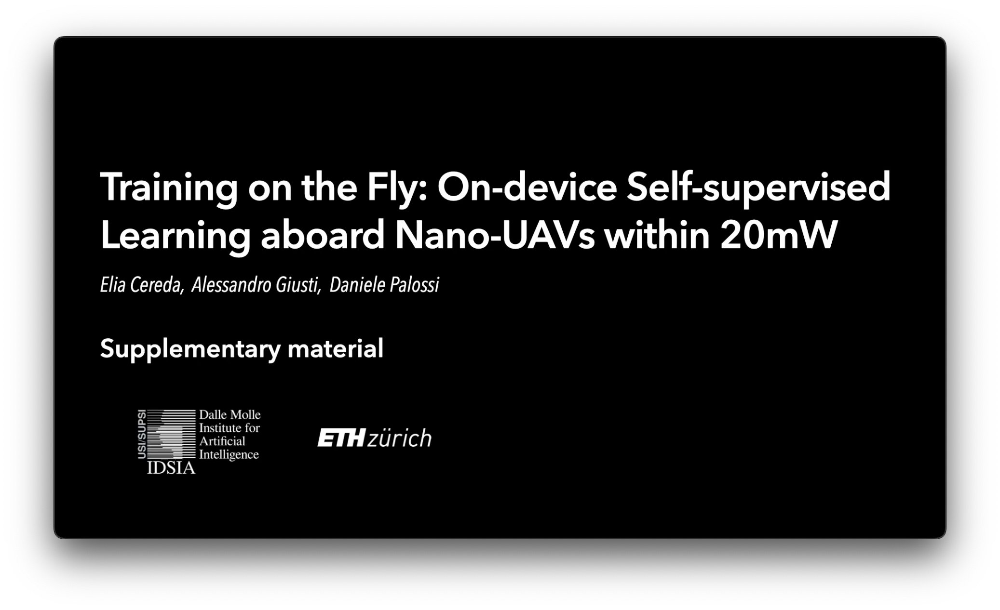

## IoT-33946-2023 — Supplementary material

Training on the Fly: On-device Self-supervised Learning aboard Nano-UAVs within 20mW

### Authors
Elia Cereda1,
Alessandro Giusti1,
Daniele Palossi1,2

1 Dalle Molle Institute for Artificial Intelligence (IDSIA), USI and SUPSI, Lugano, Switzerland. 
2 Integrated Systems Laboratory (IIS), ETH Zürich, Zürich, Switzerland. 

### Experimental results video

